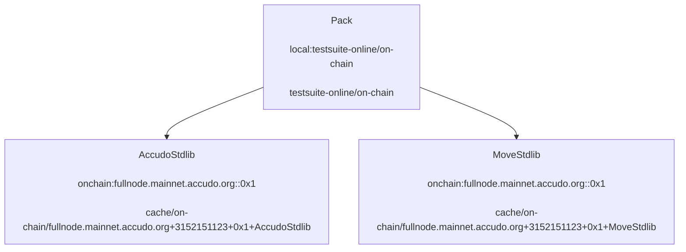

success

```mermaid
flowchart TD
    N0["Pack<br><br>local:testsuite-online/on-chain<br><br>testsuite-online/on-chain"]
    N1["AccudoStdlib<br><br>onchain:fullnode.mainnet.accudo.org::0x1<br><br>cache/on-chain/fullnode.mainnet.accudo.org+3152151123+0x1+AccudoStdlib"]
    N2["MoveStdlib<br><br>onchain:fullnode.mainnet.accudo.org::0x1<br><br>cache/on-chain/fullnode.mainnet.accudo.org+3152151123+0x1+MoveStdlib"]
    N0 --> N1
    N0 --> N2

```
